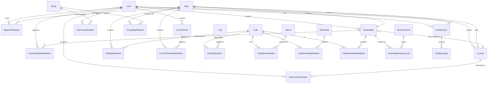
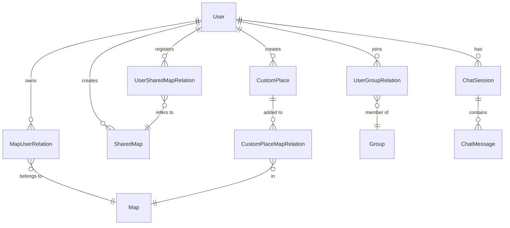
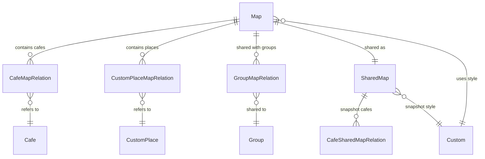
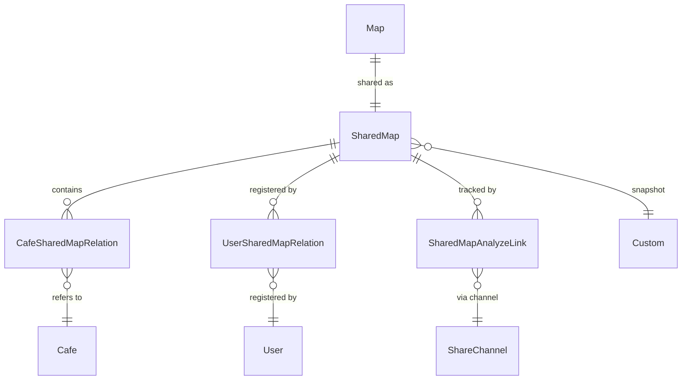

# ER図（Entity Relationship Diagram）

## 概要

このドキュメントは、Cafe Mapアプリケーションのデータベース構造を整理したものです。

## データベース構造の全体像

## テーブル一覧

### コアエンティティ

1. **User**: ユーザー
2. **Map**: マップ
3. **Cafe**: カフェ
4. **CustomPlace**: カスタム地点
5. **Group**: グループ

### 関連テーブル

6. **MapUserRelation**: マップとユーザーの関連
7. **CafeMapRelation**: カフェとマップの関連
8. **CustomPlaceMapRelation**: カスタム地点とマップの関連
9. **CafeTagRelation**: カフェとタグの関連
10. **CafeMemoRelation**: カフェとメモの関連
11. **UserGroupRelation**: ユーザーとグループの関連
12. **GroupMapRelation**: グループとマップの関連

### シェア機能

13. **ShareMap**: 共有マップ（旧モデル）
14. **CafeShareMapRelation**: カフェと共有マップの関連
15. **SharedMap**: 共有マップ（新モデル）
16. **CafeSharedMapRelation**: カフェと共有マップの関連
17. **UserSharedMapRelation**: ユーザーと共有マップの関連

### アナライズ機能

18. **ShareChannel**: 共有先マスタ
19. **SharedMapAnalyzeLink**: 共有マップのアナライズリンク

### カスタマイズ機能

20. **Custom**: カスタマイズ設定
21. **UserCustomRelation**: ユーザーとカスタマイズの関連
22. **SystemSetting**: システム設定

### チャット機能

23. **ChatSession**: チャットセッション
24. **ChatMessage**: チャットメッセージ

### その他

25. **Tag**: タグ
26. **Memo**: メモ

## 詳細テーブル定義

### 1. User（ユーザー）

| カラム名 | データ型 | 制約 | 説明 |
|---------|---------|-----|------|
| id | BIGINT | PRIMARY KEY | ユーザーID |
| name | VARCHAR(255) | UNIQUE NOT NULL | ユーザー名 |
| email | VARCHAR(255) | UNIQUE NULL | メールアドレス |
| password | VARCHAR(255) | NOT NULL | パスワードハッシュ |
| is_active | BOOLEAN | DEFAULT TRUE | アクティブフラグ |
| is_staff | BOOLEAN | DEFAULT FALSE | スタッフフラグ |
| is_superuser | BOOLEAN | DEFAULT FALSE | 管理者フラグ |
| created_at | DATETIME | AUTO | 作成日時 |
| updated_at | DATETIME | AUTO | 更新日時 |

**リレーション:**
- MapUserRelation（1:N）: 所有マップ
- CustomPlace（1:N）: 作成したカスタム地点
- SharedMap（1:N）: 作成した共有マップ
- UserSharedMapRelation（1:N）: 登録した共有マップ
- UserGroupRelation（1:N）: 参加グループ
- Custom（1:N）: 作成したカスタマイズ設定
- UserCustomRelation（1:N）: お気に入りカスタマイズ
- ChatSession（1:N）: チャットセッション

### 2. Map（マップ）

| カラム名 | データ型 | 制約 | 説明 |
|---------|---------|-----|------|
| id | BIGINT | PRIMARY KEY | マップID |
| name | VARCHAR(255) | NOT NULL | マップ名 |
| description | TEXT | NULL | マップ説明 |
| custom_id | BIGINT | FOREIGN KEY(custom.id) NULL | カスタマイズ設定ID |
| created_at | DATETIME | AUTO | 作成日時 |
| updated_at | DATETIME | AUTO | 更新日時 |

**リレーション:**
- MapUserRelation（1:N）: マップ所有者
- CafeMapRelation（1:N）: 含まれるカフェ
- CustomPlaceMapRelation（1:N）: 含まれるカスタム地点
- GroupMapRelation（1:N）: 共有先グループ
- SharedMap（1:1）: 共有マップ
- Custom（N:1）: カスタマイズ設定
- ChatSession（1:N）: 関連チャットセッション

### 3. Cafe（カフェ）

| カラム名 | データ型 | 制約 | 説明 |
|---------|---------|-----|------|
| id | BIGINT | PRIMARY KEY | カフェID |
| place_id | VARCHAR(255) | UNIQUE NOT NULL | Google Place ID |
| name | VARCHAR(255) | NOT NULL | カフェ名 |
| address | TEXT | NOT NULL | 住所 |
| latitude | DECIMAL(10,7) | NOT NULL | 緯度 |
| longitude | DECIMAL(10,7) | NOT NULL | 経度 |
| rating | FLOAT | NULL | 評価 |
| user_ratings_total | INT | NULL | レビュー数 |
| price_level | INT | NULL | 価格レベル（1-4） |
| photo_reference | VARCHAR(255) | NULL | Google Photos参照 |
| photo_url | VARCHAR(255) | NULL | 代表画像URL |
| photo_urls | JSON | NULL | 画像URLリスト |
| phone_number | VARCHAR(20) | NULL | 電話番号 |
| opening_hours | TEXT | NULL | 営業時間 |
| website | VARCHAR(255) | NULL | ウェブサイト |
| created_at | DATETIME | AUTO | 作成日時 |
| updated_at | DATETIME | AUTO | 更新日時 |

**リレーション:**
- CafeMapRelation（1:N）: 登録先マップ
- CafeTagRelation（1:N）: 付与されたタグ
- CafeMemoRelation（1:N）: 関連メモ
- CafeShareMapRelation（1:N）: 旧共有マップ
- CafeSharedMapRelation（1:N）: 共有マップ

### 4. CustomPlace（カスタム地点）

| カラム名 | データ型 | 制約 | 説明 |
|---------|---------|-----|------|
| id | BIGINT | PRIMARY KEY | カスタム地点ID |
| owner_id | BIGINT | FOREIGN KEY(users.id) NOT NULL | 作成者ID |
| name | VARCHAR(100) | NOT NULL | 地点名 |
| latitude | FLOAT | NOT NULL | 緯度（-90〜90） |
| longitude | FLOAT | NOT NULL | 経度（-180〜180） |
| image | VARCHAR(255) | NULL | 画像パス |
| place_type | VARCHAR(50) | NULL | 地点種別 |
| memo | TEXT | NULL | メモ |
| created_at | DATETIME | AUTO | 作成日時 |
| updated_at | DATETIME | AUTO | 更新日時 |

**地点種別（place_type）:**
- `photo_spot`: 写真スポット
- `meeting_point`: 待ち合わせ場所
- `viewpoint`: 景色の良い場所
- `memorial`: 記念碑・モニュメント
- `other`: その他

**リレーション:**
- User（N:1）: 作成者
- CustomPlaceMapRelation（1:N）: 登録先マップ

**インデックス:**
- `(owner_id, -created_at)`
- `(latitude, longitude)`

### 5. Group（グループ）

| カラム名 | データ型 | 制約 | 説明 |
|---------|---------|-----|------|
| id | BIGINT | PRIMARY KEY | グループID |
| uuid | UUID | UNIQUE NOT NULL | グループUUID |
| name | VARCHAR(255) | NOT NULL | グループ名 |
| description | TEXT | NULL | グループ説明 |
| created_at | DATETIME | AUTO | 作成日時 |
| updated_at | DATETIME | AUTO | 更新日時 |

**リレーション:**
- UserGroupRelation（1:N）: メンバー
- GroupMapRelation（1:N）: 共有マップ

### 6. MapUserRelation（マップとユーザーの関連）

| カラム名 | データ型 | 制約 | 説明 |
|---------|---------|-----|------|
| id | BIGINT | PRIMARY KEY | 関係ID |
| user_id | BIGINT | FOREIGN KEY(users.id) | ユーザーID |
| map_id | BIGINT | FOREIGN KEY(maps.id) | マップID |
| created_at | DATETIME | AUTO | 作成日時 |

### 7. CafeMapRelation（カフェとマップの関連）

| カラム名 | データ型 | 制約 | 説明 |
|---------|---------|-----|------|
| id | BIGINT | PRIMARY KEY | 関係ID |
| map_id | BIGINT | FOREIGN KEY(maps.id) | マップID |
| cafe_id | BIGINT | FOREIGN KEY(cafes.id) | カフェID |
| created_at | DATETIME | AUTO | 作成日時 |

### 8. CustomPlaceMapRelation（カスタム地点とマップの関連）

| カラム名 | データ型 | 制約 | 説明 |
|---------|---------|-----|------|
| id | BIGINT | PRIMARY KEY | 関係ID |
| map_id | BIGINT | FOREIGN KEY(maps.id) | マップID |
| custom_place_id | BIGINT | FOREIGN KEY(custom_place.id) | カスタム地点ID |
| is_visible | BOOLEAN | DEFAULT TRUE | 表示フラグ |
| created_at | DATETIME | AUTO | 作成日時 |

**制約:**
- UNIQUE(map_id, custom_place_id)

**インデックス:**
- `(map_id, is_visible)`

### 9. Tag（タグ）

| カラム名 | データ型 | 制約 | 説明 |
|---------|---------|-----|------|
| id | BIGINT | PRIMARY KEY | タグID |
| name | VARCHAR(255) | UNIQUE NOT NULL | タグ名 |
| color | VARCHAR(10) | NULL | カラーコード |
| created_at | DATETIME | AUTO | 作成日時 |
| updated_at | DATETIME | AUTO | 更新日時 |

### 10. CafeTagRelation（カフェとタグの関連）

| カラム名 | データ型 | 制約 | 説明 |
|---------|---------|-----|------|
| id | BIGINT | PRIMARY KEY | 関係ID |
| cafe_id | BIGINT | FOREIGN KEY(cafes.id) | カフェID |
| tag_id | BIGINT | FOREIGN KEY(tags.id) | タグID |
| created_at | DATETIME | AUTO | 作成日時 |

### 11. Memo（メモ）

| カラム名 | データ型 | 制約 | 説明 |
|---------|---------|-----|------|
| id | BIGINT | PRIMARY KEY | メモID |
| memo | TEXT | NOT NULL | メモ内容 |
| created_at | DATETIME | AUTO | 作成日時 |
| updated_at | DATETIME | AUTO | 更新日時 |

### 12. CafeMemoRelation（カフェとメモの関連）

| カラム名 | データ型 | 制約 | 説明 |
|---------|---------|-----|------|
| id | BIGINT | PRIMARY KEY | 関係ID |
| cafe_id | BIGINT | FOREIGN KEY(cafes.id) | カフェID |
| memo_id | BIGINT | FOREIGN KEY(memos.id) | メモID |
| created_at | DATETIME | AUTO | 作成日時 |

### 13. ShareMap（共有マップ - 旧モデル）

| カラム名 | データ型 | 制約 | 説明 |
|---------|---------|-----|------|
| id | BIGINT | PRIMARY KEY | 共有マップID |
| name | VARCHAR(255) | NOT NULL | 共有マップ名 |
| created_at | DATETIME | AUTO | 作成日時 |
| updated_at | DATETIME | AUTO | 更新日時 |

**Note:** 旧モデル。新規開発ではSharedMapを使用。

### 14. CafeShareMapRelation（カフェと共有マップの関連 - 旧モデル）

| カラム名 | データ型 | 制約 | 説明 |
|---------|---------|-----|------|
| id | BIGINT | PRIMARY KEY | 関係ID |
| share_map_id | BIGINT | FOREIGN KEY(share_maps.id) | 共有マップID |
| cafe_id | BIGINT | FOREIGN KEY(cafes.id) | カフェID |
| created_at | DATETIME | AUTO | 作成日時 |

### 15. SharedMap（共有マップ）

| カラム名 | データ型 | 制約 | 説明 |
|---------|---------|-----|------|
| id | BIGINT | PRIMARY KEY | 共有マップID |
| original_map_id | BIGINT | FOREIGN KEY(maps.id) UNIQUE | 元のマップID |
| share_uuid | UUID | UNIQUE NOT NULL | 共有UUID |
| creator_id | BIGINT | FOREIGN KEY(users.id) | 作成者ID |
| custom_id | BIGINT | FOREIGN KEY(custom.id) NULL | カスタマイズ設定ID（スナップショット） |
| title | VARCHAR(255) | NULL | タイトル |
| description | TEXT | NULL | 説明 |
| allow_sync | BOOLEAN | DEFAULT FALSE | 同期許可フラグ |
| is_active | BOOLEAN | DEFAULT TRUE | 有効フラグ |
| expires_at | DATETIME | NULL | 有効期限 |
| direct_access_count | INT | DEFAULT 0 | 直接アクセス数 |
| direct_last_accessed_at | DATETIME | NULL | 直接最終アクセス日時 |
| created_at | DATETIME | AUTO | 作成日時 |

**リレーション:**
- Map（1:1）: 元のマップ
- User（N:1）: 作成者
- Custom（N:1）: カスタマイズ設定（スナップショット）
- CafeSharedMapRelation（1:N）: 含まれるカフェ
- UserSharedMapRelation（1:N）: 登録ユーザー
- SharedMapAnalyzeLink（1:N）: アナライズリンク

### 16. CafeSharedMapRelation（カフェと共有マップの関連）

| カラム名 | データ型 | 制約 | 説明 |
|---------|---------|-----|------|
| id | BIGINT | PRIMARY KEY | 関係ID |
| shared_map_id | BIGINT | FOREIGN KEY(shared_map.id) | 共有マップID |
| cafe_id | BIGINT | FOREIGN KEY(cafes.id) | カフェID |
| created_at | DATETIME | AUTO | 作成日時 |

### 17. UserSharedMapRelation（ユーザーと共有マップの関連）

| カラム名 | データ型 | 制約 | 説明 |
|---------|---------|-----|------|
| id | BIGINT | PRIMARY KEY | 関係ID |
| user_id | BIGINT | FOREIGN KEY(users.id) | ユーザーID |
| shared_map_id | BIGINT | FOREIGN KEY(shared_map.id) | 共有マップID |
| created_at | DATETIME | AUTO | 作成日時 |

**制約:**
- UNIQUE(user_id, shared_map_id)

### 18. UserGroupRelation（ユーザーとグループの関連）

| カラム名 | データ型 | 制約 | 説明 |
|---------|---------|-----|------|
| id | BIGINT | PRIMARY KEY | 関係ID |
| user_id | BIGINT | FOREIGN KEY(users.id) | ユーザーID |
| group_id | BIGINT | FOREIGN KEY(groups.id) | グループID |
| created_at | DATETIME | AUTO | 作成日時 |

**制約:**
- UNIQUE(user_id, group_id)

### 19. GroupMapRelation（グループとマップの関連）

| カラム名 | データ型 | 制約 | 説明 |
|---------|---------|-----|------|
| id | BIGINT | PRIMARY KEY | 関係ID |
| group_id | BIGINT | FOREIGN KEY(groups.id) | グループID |
| map_id | BIGINT | FOREIGN KEY(maps.id) | マップID |
| created_at | DATETIME | AUTO | 作成日時 |

**制約:**
- UNIQUE(group_id, map_id)

### 20. ShareChannel（共有先マスタ）

| カラム名 | データ型 | 制約 | 説明 |
|---------|---------|-----|------|
| id | BIGINT | PRIMARY KEY | チャネルID |
| key | VARCHAR(50) | UNIQUE NOT NULL | チャネルキー（x, blog, email等） |
| name | VARCHAR(100) | NOT NULL | チャネル名（X, ブログ等） |
| description | TEXT | NULL | 説明 |
| icon | VARCHAR(100) | NULL | アイコン名 |
| sort_order | INT | DEFAULT 0 | 表示順 |
| is_active | BOOLEAN | DEFAULT TRUE | 有効フラグ |
| created_at | DATETIME | AUTO | 作成日時 |
| updated_at | DATETIME | AUTO | 更新日時 |

**インデックス:**
- `(is_active, sort_order)`

### 21. SharedMapAnalyzeLink（共有マップのアナライズリンク）

| カラム名 | データ型 | 制約 | 説明 |
|---------|---------|-----|------|
| id | BIGINT | PRIMARY KEY | リンクID |
| shared_map_id | BIGINT | FOREIGN KEY(shared_map.id) | 共有マップID |
| channel_id | BIGINT | FOREIGN KEY(share_channel.id) | チャネルID |
| custom_label | VARCHAR(255) | NULL | カスタムラベル |
| share_link_url | TEXT | NOT NULL | シェアリンクURL |
| access_count | INT | DEFAULT 0 | アクセス数 |
| last_accessed_at | DATETIME | NULL | 最終アクセス日時 |
| is_active | BOOLEAN | DEFAULT TRUE | 有効フラグ |
| created_at | DATETIME | AUTO | 作成日時 |
| updated_at | DATETIME | AUTO | 更新日時 |

**制約:**
- UNIQUE(shared_map_id, channel_id)

**インデックス:**
- `(shared_map_id)`
- `(shared_map_id, is_active)`

### 22. Custom（カスタマイズ設定）

| カラム名 | データ型 | 制約 | 説明 |
|---------|---------|-----|------|
| id | BIGINT | PRIMARY KEY | カスタムID |
| name | VARCHAR(255) | NOT NULL | カスタマイズ名 |
| description | TEXT | NULL | 説明 |
| map_style | VARCHAR(50) | DEFAULT 'default' | マップスタイル |
| icon_variant | VARCHAR(50) | DEFAULT 'photo' | アイコン種別 |
| icon_color | VARCHAR(7) | DEFAULT '#3B82F6' | アイコン色 |
| icon_size | INT | DEFAULT 48 | アイコンサイズ（24-96） |
| show_labels | BOOLEAN | DEFAULT TRUE | ラベル表示 |
| border_color | VARCHAR(7) | NULL | ボーダー色 |
| background_color | VARCHAR(7) | NULL | 背景色 |
| created_by_user_id | BIGINT | FOREIGN KEY(users.id) NULL | 作成者ID |
| is_snapshot | BOOLEAN | DEFAULT FALSE | スナップショットフラグ |
| is_public | BOOLEAN | DEFAULT FALSE | 公開フラグ |
| original_custom_id | BIGINT | FOREIGN KEY(custom.id) NULL | 元のカスタムID |
| created_at | DATETIME | AUTO | 作成日時 |
| updated_at | DATETIME | AUTO | 更新日時 |

**マップスタイル（map_style）:**
- `default`: デフォルト
- `light`: ライト
- `dark`: ダーク
- `mono`: モノクロ

**アイコン種別（icon_variant）:**
- `pin`: ピン
- `badge`: バッジ
- `bubble`: 吹き出し
- `photo`: 写真

**リレーション:**
- User（N:1）: 作成者
- Custom（N:1）: 元のカスタマイズ（自己参照）
- Map（1:N）: 使用マップ
- SharedMap（1:N）: 使用共有マップ
- UserCustomRelation（1:N）: お気に入り登録

**インデックス:**
- `(created_by_user_id)`
- `(is_public, is_snapshot)`

### 23. UserCustomRelation（ユーザーとカスタマイズの関連）

| カラム名 | データ型 | 制約 | 説明 |
|---------|---------|-----|------|
| id | BIGINT | PRIMARY KEY | 関係ID |
| user_id | BIGINT | FOREIGN KEY(users.id) | ユーザーID |
| custom_id | BIGINT | FOREIGN KEY(custom.id) | カスタムID |
| is_favorite | BOOLEAN | DEFAULT FALSE | お気に入りフラグ |
| created_at | DATETIME | AUTO | 作成日時 |

**制約:**
- UNIQUE(user_id, custom_id)

### 24. SystemSetting（システム設定）

| カラム名 | データ型 | 制約 | 説明 |
|---------|---------|-----|------|
| id | BIGINT | PRIMARY KEY | 設定ID |
| key | VARCHAR(255) | UNIQUE NOT NULL | 設定キー |
| value | TEXT | NOT NULL | 設定値 |
| description | TEXT | NULL | 説明 |
| created_at | DATETIME | AUTO | 作成日時 |
| updated_at | DATETIME | AUTO | 更新日時 |

**使用例:**
- `default_custom_id`: デフォルトカスタマイズID

### 25. ChatSession（チャットセッション）

| カラム名 | データ型 | 制約 | 説明 |
|---------|---------|-----|------|
| id | BIGINT | PRIMARY KEY | セッションID |
| user_id | BIGINT | FOREIGN KEY(users.id) | ユーザーID |
| map_id | BIGINT | FOREIGN KEY(maps.id) NULL | マップID（コンテキスト） |
| context_type | VARCHAR(50) | DEFAULT 'general' | コンテキスト種別 |
| context_data | JSON | NULL | コンテキストデータ |
| title | VARCHAR(255) | NULL | セッションタイトル |
| is_active | BOOLEAN | DEFAULT TRUE | 有効フラグ |
| created_at | DATETIME | AUTO | 作成日時 |
| updated_at | DATETIME | AUTO | 更新日時 |
| last_message_at | DATETIME | AUTO | 最終メッセージ日時 |

**コンテキスト種別（context_type）:**
- `general`: 一般
- `cafe_search`: カフェ検索
- `map_creation`: マップ作成

**リレーション:**
- User（N:1）: ユーザー
- Map（N:1）: 関連マップ
- ChatMessage（1:N）: メッセージ

**インデックス:**
- `(user_id, -last_message_at)`
- `(user_id, is_active)`

### 26. ChatMessage（チャットメッセージ）

| カラム名 | データ型 | 制約 | 説明 |
|---------|---------|-----|------|
| id | BIGINT | PRIMARY KEY | メッセージID |
| session_id | BIGINT | FOREIGN KEY(chat_session.id) | セッションID |
| role | VARCHAR(10) | NOT NULL | ロール |
| content | TEXT | NOT NULL | メッセージ内容 |
| tokens_used | INT | NULL | 使用トークン数 |
| response_time_ms | INT | NULL | 応答時間（ミリ秒） |
| model_name | VARCHAR(50) | NULL | 使用モデル |
| related_cafes | JSON | NULL | 関連カフェID配列 |
| related_location | JSON | NULL | 関連位置情報 |
| created_at | DATETIME | AUTO | 作成日時 |

**ロール（role）:**
- `user`: ユーザー
- `assistant`: AI
- `system`: システム

**リレーション:**
- ChatSession（N:1）: セッション

**インデックス:**
- `(session_id, created_at)`

**ソート順:**
- created_at（昇順）

## 主要なリレーションシップ

### ユーザー中心のリレーション

### マップ中心のリレーション

### シェア・アナライズのリレーション

## データモデルの設計パターン

### 1. 多対多リレーション

中間テーブルを使用して多対多の関係を実現しています。

**例:**
- User ⇔ Map（MapUserRelation）
- Cafe ⇔ Map（CafeMapRelation）
- CustomPlace ⇔ Map（CustomPlaceMapRelation）
- User ⇔ Group（UserGroupRelation）
- Group ⇔ Map（GroupMapRelation）
- Cafe ⇔ Tag（CafeTagRelation）

### 2. 1対1リレーション

マップと共有マップは1対1の関係です。

**例:**
- Map ⇔ SharedMap（original_map_idにUNIQUE制約）

### 3. 自己参照リレーション

カスタマイズ設定は自己参照によりスナップショット機能を実現しています。

**例:**
- Custom ⇔ Custom（original_custom_id）

### 4. ソフトデリート

一部のテーブルではis_activeフラグを使用してソフトデリートを実現しています。

**例:**
- SharedMap.is_active
- ChatSession.is_active
- ShareChannel.is_active

### 5. UUIDによる公開リンク

外部公開用のリソースにはUUIDを使用しています。

**例:**
- Group.uuid
- SharedMap.share_uuid

### 6. スナップショット

共有マップではCustom設定のスナップショットを保持しています。

**設計:**
- SharedMapは作成時点のCustom設定への参照を保持
- Customのis_snapshot=Trueでスナップショット判定
- original_custom_idで元の設定を参照

## インデックス設計

### 主要なインデックス

1. **CustomPlace**
   - `(owner_id, -created_at)`: ユーザーのカスタム地点一覧取得
   - `(latitude, longitude)`: 位置情報検索

2. **ChatSession**
   - `(user_id, -last_message_at)`: セッション一覧取得
   - `(user_id, is_active)`: アクティブセッション取得

3. **ChatMessage**
   - `(session_id, created_at)`: メッセージ履歴取得

4. **ShareChannel**
   - `(is_active, sort_order)`: アクティブチャネル一覧取得

5. **SharedMapAnalyzeLink**
   - `(shared_map_id)`: 共有マップのリンク一覧取得
   - `(shared_map_id, is_active)`: アクティブリンク取得

6. **Custom**
   - `(created_by_user_id)`: ユーザーのカスタム設定一覧
   - `(is_public, is_snapshot)`: 公開設定・スナップショット検索

7. **CustomPlaceMapRelation**
   - `(map_id, is_visible)`: マップの表示カスタム地点取得

## 制約設計

### UNIQUE制約

1. **User**
   - `name`: ユーザー名の一意性
   - `email`: メールアドレスの一意性

2. **Cafe**
   - `place_id`: Google Place IDの一意性

3. **Tag**
   - `name`: タグ名の一意性

4. **Group**
   - `uuid`: グループUUIDの一意性

5. **SharedMap**
   - `share_uuid`: 共有UUIDの一意性
   - `original_map_id`: 1マップにつき1共有マップ

6. **ShareChannel**
   - `key`: チャネルキーの一意性

7. **SystemSetting**
   - `key`: 設定キーの一意性

### 複合UNIQUE制約

1. **UserGroupRelation**
   - `(user_id, group_id)`: 重複参加防止

2. **GroupMapRelation**
   - `(group_id, map_id)`: 重複紐付け防止

3. **UserSharedMapRelation**
   - `(user_id, shared_map_id)`: 重複登録防止

4. **CustomPlaceMapRelation**
   - `(map_id, custom_place_id)`: 重複登録防止

5. **SharedMapAnalyzeLink**
   - `(shared_map_id, channel_id)`: 1共有マップ×1チャネルにつき1リンク

6. **UserCustomRelation**
   - `(user_id, custom_id)`: 重複お気に入り防止

## マイグレーション履歴

1. **0001_initial.py**: 初期テーブル作成
2. **0002_*.py**: アナライズ機能追加（ShareChannel, SharedMap拡張）
3. **0003_populate_share_channels.py**: 共有先マスタデータ投入
4. **0004_custom_*.py**: カスタマイズ機能追加（Custom, SystemSetting）
5. **0005_create_default_custom.py**: デフォルトカスタム設定作成
6. **0006_chatsession_chatmessage_*.py**: チャット機能追加
7. **0007_customplace_*.py**: カスタム地点機能追加

## 関連ドキュメント

- [テーブル定義](../diagrams/tables.md)
- [画面遷移図](./画面遷移図.md)
- [カフェ検索機能](./カフェ検索機能.md)
- [カスタム地点登録機能](./カスタム地点登録機能.md)
- [カスタマイズ機能](./カスタマイズ機能.md)
- [アナライズ機能](./アナライズ機能.md)
- [チャット機能](./チャット機能.md)
