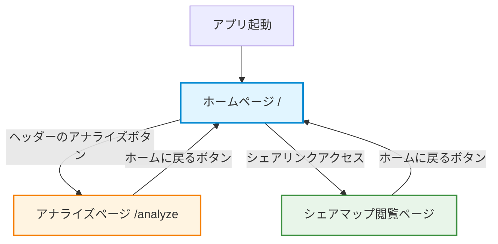
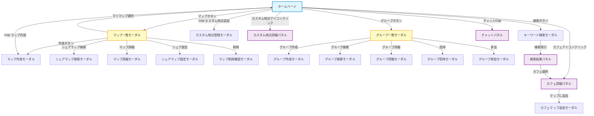
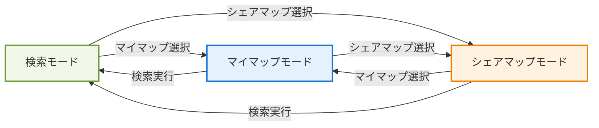
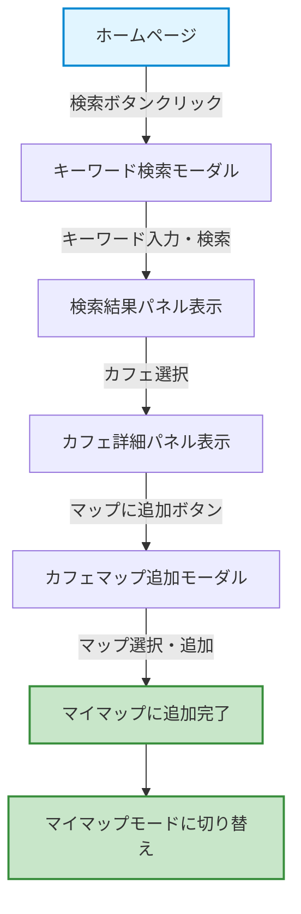
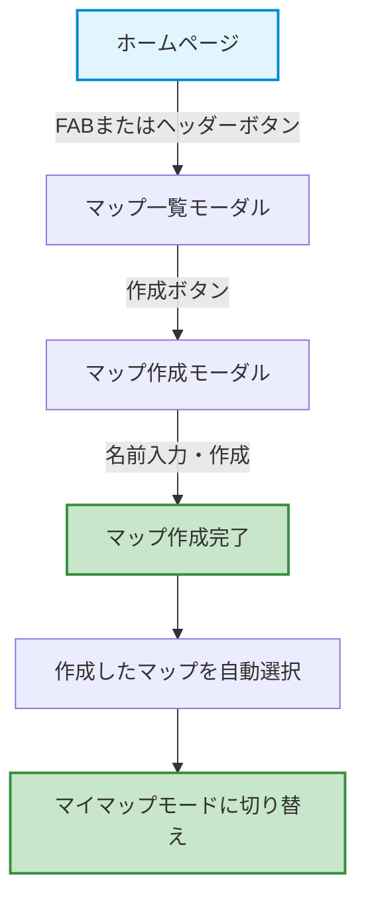
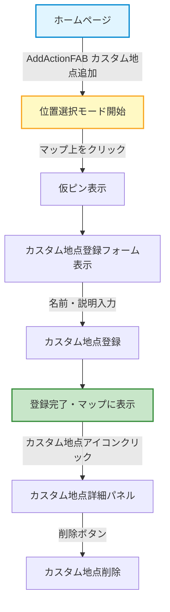
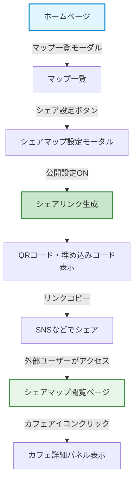
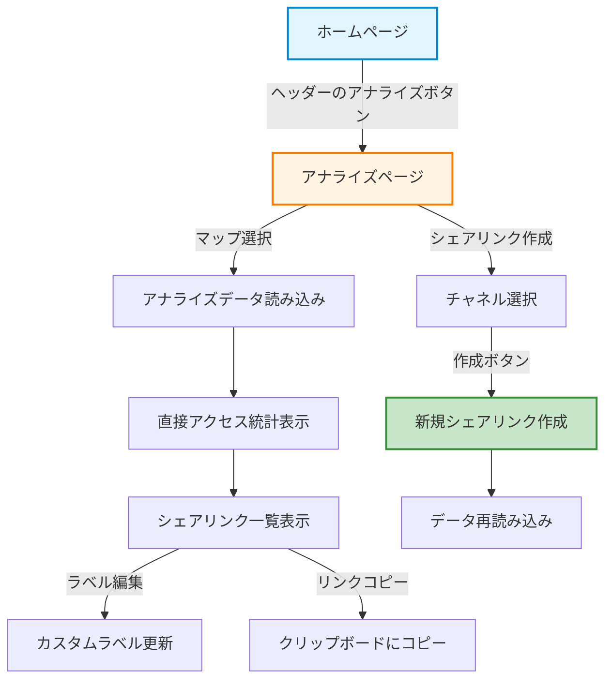

# 画面遷移図

## 概要

このドキュメントは、Cafe Mapアプリケーションの画面遷移とモーダル・パネルの関係を整理したものです。

## ルーティング構成

アプリケーションは以下の3つのページで構成されています。

```
/                           - ホームページ (HomePage)
/shared-maps/:uuid          - シェアマップ閲覧ページ (SharedMapViewPage)
/analyze                    - アナライズページ (AnalyzePage)
```

## ページ構成

### 1. ホームページ (HomePage) - `/`

メインとなるマップ閲覧・検索・管理ページ

#### 主要コンポーネント
- **Header**: ヘッダー（ユーザーメニュー、マップ選択など）
- **Map**: Google Mapコンポーネント
- **FooterActions**: フッターアクションボタン（モバイル対応）
- **AddActionFAB**: マップ作成・カスタム地点追加のFAB
- **ChatFAB**: チャット機能のFAB

#### 表示されるパネル
- **MyCafeListPanel**: 登録済みカフェ一覧パネル（サイドパネル）
- **SearchResultPanel**: 検索結果パネル（サイドパネル）
- **CafeDetailPanel**: カフェ詳細パネル（ボトムシート）
- **CustomPlaceDetailPanel**: カスタム地点詳細パネル（ボトムシート）
- **ChatPanel**: チャットパネル（サイドパネル）

#### モーダル一覧
1. **MapListModal**: マップ一覧・管理モーダル
2. **MapCreateModal**: マップ作成モーダル
3. **CafeMapAssignModal**: カフェをマップに追加するモーダル
4. **CustomPlaceFormModal**: カスタム地点登録フォームモーダル
5. **KeywordSearchModal**: キーワード検索モーダル（Map内）
6. **GroupListModal**: グループ一覧モーダル（Header内）

### 2. シェアマップ閲覧ページ (SharedMapViewPage) - `/shared-maps/:uuid`

公開されたシェアマップを閲覧するページ

#### 主要コンポーネント
- **Header**: ヘッダー（シェアマップ用、シンプル版）
- **GoogleMap**: Google Mapコンポーネント
- **CafeOverlayIcon**: カフェアイコン（複数）
- **CafeDetailPanel**: カフェ詳細パネル

#### 特徴
- 認証不要で閲覧可能
- カフェの追加・編集などの操作は不可
- UUIDでアクセス管理
- クエリパラメータ `src` でアクセス元トラッキング

### 3. アナライズページ (AnalyzePage) - `/analyze`

シェアマップのアクセス解析ページ

#### 主要コンポーネント
- **Header**: ヘッダー（シンプル版）
- **マップ選択UI**: マップセレクトボックス
- **直接アクセス統計**: 直接アクセス数・最終アクセス日時
- **シェアリンク作成UI**: 新規シェアリンク作成フォーム
- **シェアリンク一覧テーブル**: 作成済みシェアリンクのリスト・統計

#### 機能
- ログインユーザーのみアクセス可
- マップごとのアクセス解析
- チャネル別（SNS、ブログなど）のトラッキング
- カスタムラベル編集機能

## 画面遷移フロー



## HomePage内のモーダル遷移



## パネルとモーダルの分類

### サイドパネル（横からスライド）
- **MyCafeListPanel**: 登録済みカフェ一覧
- **SearchResultPanel**: 検索結果一覧
- **ChatPanel**: チャット機能

### ボトムシート（下からスライド、モバイル）/ サイドパネル（デスクトップ）
- **CafeDetailPanel**: カフェ詳細情報
- **CustomPlaceDetailPanel**: カスタム地点詳細情報

### モーダルダイアログ（中央オーバーレイ）
#### マップ関連
- **MapListModal**: マップ一覧・切り替え
- **MapCreateModal**: マップ作成
- **MapDetailModal**: マップ詳細・編集
- **MapDeleteModal**: マップ削除確認
- **ShareMapModal**: シェア設定・QRコード・埋め込みコード
- **SharedMapSearchModal**: シェアマップ検索
- **CafeMapAssignModal**: カフェをマップに追加
- **MapCustomizeModal**: マップカスタマイズ設定

#### グループ関連
- **GroupListModal**: グループ一覧
- **GroupCreateModal**: グループ作成
- **GroupDetailModal**: グループ詳細
- **GroupSearchModal**: グループ検索
- **GroupInvitationModal**: グループ招待
- **GroupJoinModal**: グループ参加
- **GroupIconUploadModal**: グループアイコンアップロード

#### カスタム地点関連
- **CustomPlaceFormModal**: カスタム地点登録・編集

#### 検索関連
- **KeywordSearchModal**: キーワード検索

## マップモード

アプリケーションには3つのマップモードがあります。

```javascript
MAP_MODES = {
  mycafe: 'mycafe',      // マイマップモード（登録済みカフェ表示）
  share: 'share',        // シェアマップモード（シェアマップのカフェ表示）
  search: 'search'       // 検索モード（検索結果のカフェ表示）
}
```

### モード遷移



## 主要な操作フロー

### 1. カフェ検索からマップ登録フロー



### 2. マップ作成フロー



### 3. カスタム地点登録フロー



### 4. シェアマップ作成・閲覧フロー



### 5. アナライズ機能フロー



## 状態管理

### コンテキスト

アプリケーションでは以下のコンテキストで状態を管理しています。

```
AuthContext      - ユーザー認証情報
MapContext       - 選択中のマップ、マップモード
CafeContext      - カフェ一覧、選択中のカフェ
GroupContext     - グループ関連の状態
```

### 主要な状態遷移

| 操作 | 更新される状態 | コンテキスト | 副作用 |
|------|---------------|-------------|--------|
| マップ選択 | selectedMap, mapMode | MapContext | マップに紐づくカフェ・カスタム地点の取得 |
| キーワード検索実行 | searchResultCafes | CafeContext | 検索結果パネルの表示 |
| 検索結果からカフェ選択 | selectedSearchedCafe | CafeContext | カフェ詳細パネルの表示 |
| マイカフェからカフェ選択 | selectedRegisteredCafe | CafeContext | カフェ詳細パネルの表示 |
| カフェをマップに追加 | myCafeList | CafeContext | APIリクエスト、データ再取得 |
| シェアマップを開く | selectedMap, mapMode='share' | MapContext | シェアマップのカフェ取得 |
| ログイン | user | AuthContext | 初期データの取得 |
| ログアウト | user=null, 各状態リセット | 全コンテキスト | キャッシュクリア |

## レスポンシブ対応

### モバイル (< 768px)
- サイドパネルは全画面表示
- ボトムシートは下からスライド
- FooterActionsを表示
- FABを表示

### デスクトップ (≥ 768px)
- サイドパネルは右側に表示
- カフェ詳細も右側パネルとして表示
- FooterActionsは非表示（ヘッダーのボタンを使用）
- FABを表示

## 関連ドキュメント

- [コンポーネント構成図](../diagrams/ComponentConfiguration.md)
- [カフェ検索機能](./カフェ検索機能.md)
- [カスタム地点登録機能](./カスタム地点登録機能.md)
- [カスタマイズ機能](./カスタマイズ機能.md)
- [アナライズ機能](./アナライズ機能.md)
- [チャット機能](./チャット機能.md)
